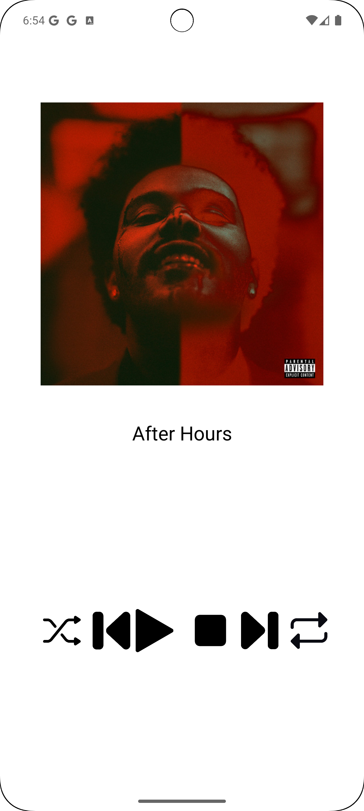
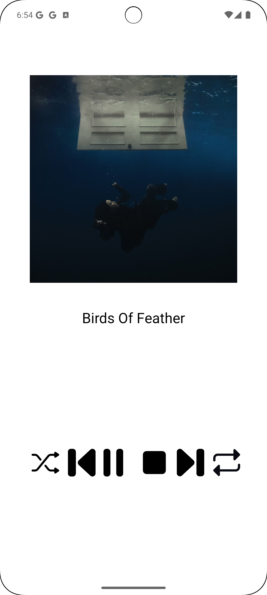

# Android Music Player App

An Android music player application with a user-friendly interface for playing, pausing, stopping, and navigating between songs. The app uses `MediaPlayer` for audio playback and allows users to switch between different songs, with album art and song titles displayed on the screen.

## Features

- **Play/Pause Control**: Easily play or pause the current song with a single button.
- **Stop Control**: Stop the current song and reset the playback.
- **Next/Previous Navigation**: Navigate through the playlist to play the next or previous song.
- **Album Art and Song Titles**: Display album art and song titles for the current track.
- **Shuffle and Repeat Buttons**: Icons are included for shuffle and repeat functionality (yet to be implemented).
## Screenshots
  


## Technologies Used

- **Java**: The main programming language for app logic.
- **Android XML**: For defining the user interface layout.
- **MediaPlayer API**: Used for audio playback.
- **Android Studio**: The IDE used for development.
- **ConstraintLayout**: The primary layout for structuring UI elements.

## Setup and Installation

1. **Clone the Repository**:
   ```bash
   git clone https://github.com/ranaehelal/Android-music-player.git
   ```
2. **Open in Android Studio**:
   - Launch Android Studio and select **Open an Existing Project**.
   - Navigate to the project directory and open it.

3. **Add Audio Files**:
   - Place your audio files (e.g., `after_hours.mp3`, `birds_of_feather.mp3`) in the `res/raw` directory.
   
4. **Run the App**:
   - Connect your Android device or use an emulator.
   - Click on the **Run** button in Android Studio to install and launch the app.

## Usage

1. **Play a Song**: 
   - The app automatically plays the first song in the playlist on startup. Use the **Play/Pause** button to control playback.

2. **Navigate Between Songs**:
   - Use the **Next** and **Previous** buttons to move between songs.

3. **Stop the Song**:
   - Press the **Stop** button to stop playback. This also resets the play/pause button to the play icon.

4. **Shuffle and Repeat**:
   - These buttons are placeholders. Additional functionality can be implemented to enable shuffle and repeat modes.

## Implementation Details

- **MainActivity.java**:
  - Handles UI initialization, setting up the `MediaPlayer`, managing song changes, and button click listeners.
  
- **Song.java**:
  - A data model class that holds the song name, audio file resource ID, and album art resource ID.

- **activity_main.xml**:
  - The layout file defining the UI elements like `ImageView`, `TextView`, and `ImageButton` controls within a `ConstraintLayout`.

## Future Enhancements

- **Shuffle and Repeat Functions**: Implement full functionality for shuffle and repeat buttons.
- **Improved UI**: Make UI more responsive and adapt to different screen sizes.
- **Additional Controls**: Volume control, playback progress, and song duration display.
- **Playlist Management**: Allow users to create and manage custom playlists.

## Contact

For any questions or suggestions, feel free to reach out to `ranaesmailhelal@gmail.com`.


